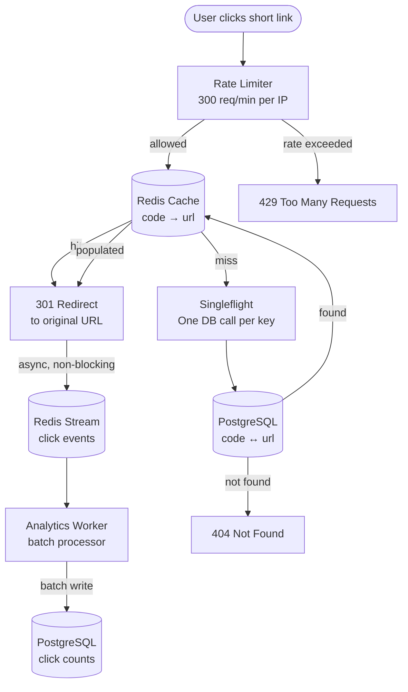

# urlforge

URL shortener built in Go. Designed to handle read-heavy traffic
with async analytics and cache-first architecture.

## System design

**Stack**: Go · PostgreSQL · Redis · Redis Stream

**ID generation**: Auto-increment → Base62 encoding

- 62^6 = 56 billion unique codes
- Bidirectional storage: code→url and url→code

**Read path**:
Rate limiter → Redis cache → (miss) singleflight → DB
→ redirect → async push to Redis Stream

**Why these choices**:

- Redis for cache: read/write ratio is ~1000:1, cache hit rate >99%
- Singleflight: prevents thundering herd on cache miss
- Redis Stream: analytics writes are best-effort, async, non-blocking
- PostgreSQL: simple key-value lookups, fast with index on code column
- At scale: would replace Postgres with Cassandra (no relations,
  read-heavy, eventual consistency acceptable)

## API Flow

### Redirection



## Run locally

```bash

git clone git@github.com:SXsid/url-forge.git
docker compose up
# or
go run ./cmd/migrate/main.go
go run ./cmd/urlforge
```
